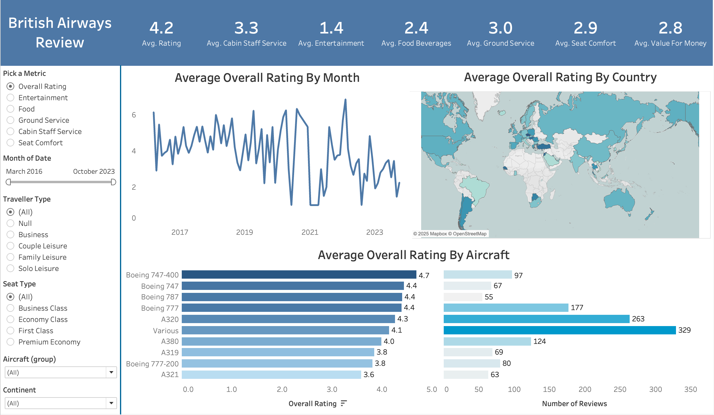
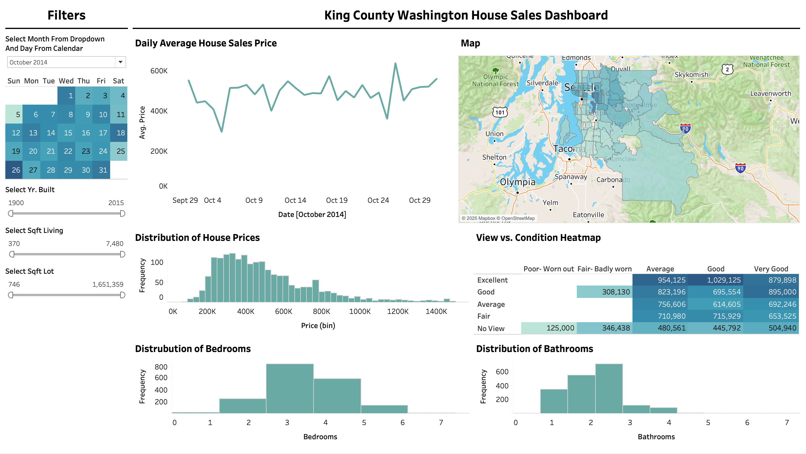
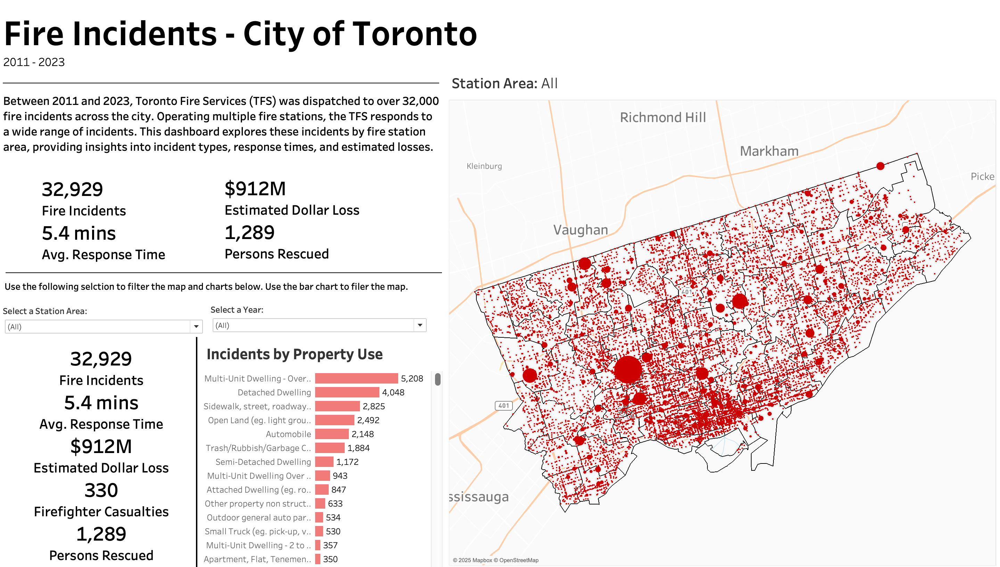

# Tableau Projects

This repository contains three Tableau projects focusing on different datasets and analyses:

## British Airways Reviews

This project analyzes customer reviews for British Airways flights.

### Files:
- `British Airways Review.twb`: Tableau workbook containing the analysis
- `ba_reviews.csv`: Dataset with British Airways customer reviews
- `Countries.csv`: Supplementary dataset with country information

### Key Features:
- Customer satisfaction analysis
- Route performance visualization
- Sentiment analysis of review comments

## Washington House Sales

This project examines house sales data in Washington state.

### Files:
- `Washington House Sales.twb`: Tableau workbook with the analysis
- `HouseData.xlsx`: Dataset containing Washington house sales information

### Key Features:
- Price trends over time
- Geographic distribution of sales
- Property feature impact on pricing

## Toronto Fire Incidents

This project visualizes fire incident data for the City of Toronto.

### Files:
- `City of Toronto - Fire Incidents.twb`: Tableau workbook with the analysis
- `Fire Incidents Data.xlsm`: Dataset with Toronto fire incident information
- `RunArea-StationName 1.csv`: Supplementary dataset linking run areas to station names
- `toronto-fire-services-run-areas - 4326.geojson`: GeoJSON file for Toronto fire service areas

### Key Features:
- Incident frequency by location and time
- Response time analysis
- Fire station coverage visualization

## How to Use

1. Clone this repository to your local machine.
2. Open the desired `.twb` file using Tableau Desktop.
3. Ensure that the corresponding data files are in the same directory as the Tableau workbook.
4. Explore the dashboards and visualizations within each project.

## Requirements

- Tableau Desktop (version 2021.1 or later recommended)
- Microsoft Excel (for .xlsx and .xlsm files)
- CSV file reader
- GeoJSON file support (for the Toronto Fire Incidents project)
